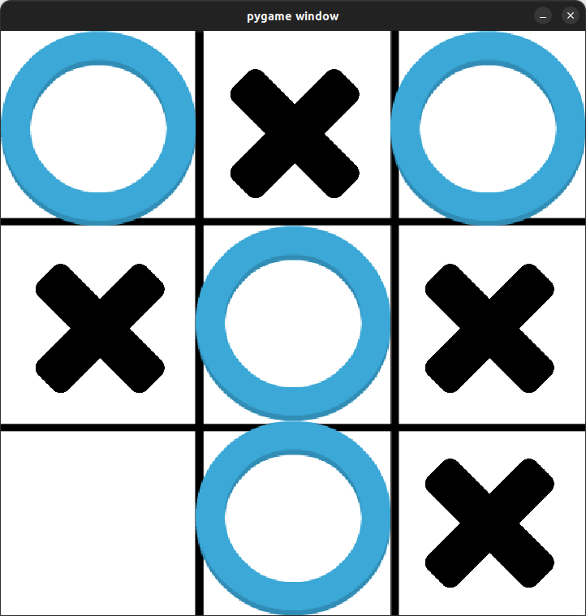

# Tic Tac Toe




A basic Tic Tac Toe game built using pygame. No dependencies required.

## Install and Run

### Install 
```bash
git clone https://github.com/lucasmelosilva/tic_tac_toe
```

### Run
```bash 
cd ./tic_tac_toe

./tic_tac_toe
```

## TODO

- [x] Check winning sequence
- [X] Check if no winner
- [x] Reset game